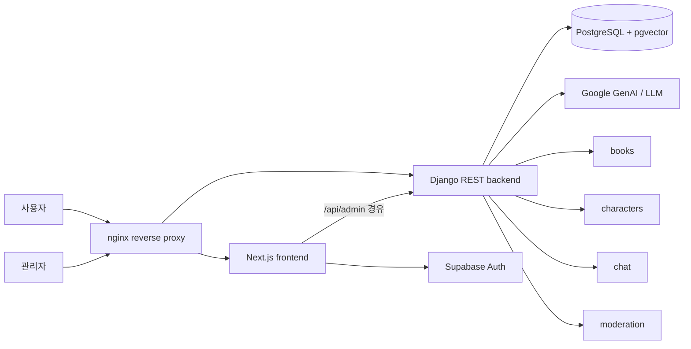

<p align="right">
  <a href="../README.md">언어 선택</a> · <strong>한국어</strong> · <a href="README.en.md">English</a>
</p>

# Book Lens

**Book Lens**는 동화책 검색, 캐릭터 선택, 세션 기반 AI 채팅, 사용자 설정, 관리자 운영 화면을 하나로 연결한 AI 동화 경험 서비스입니다.

<p align="center">
  
  
</p>

---

## 목차

- [프로젝트 개요](#프로젝트-개요)
- [핵심 기능](#핵심-기능)
- [화면 미리보기](#화면-미리보기)
- [기술 스택](#기술-스택)
- [아키텍처](#아키텍처)
- [실행 방법](#실행-방법)
- [테스트](#테스트)
- [현재 제약과 후속 과제](#현재-제약과-후속-과제)
- [문서와 자산](#문서와-자산)

---

## 프로젝트 개요

Book Lens는 사용자가 동화책을 탐색하고, 책 속 캐릭터와 대화하며, 개인 설정에 맞는 응답 경험을 이어갈 수 있도록 만든 서비스입니다. 관리자는 도서와 캐릭터를 등록하고, 임베딩을 생성하며, 페르소나와 금지어 규칙을 관리할 수 있습니다.

이 저장소는 프론트엔드, 백엔드, 인프라 설정, 테스트 문서를 함께 포함합니다.

```text
book-lens/
├── frontend/       # Next.js 기반 사용자/관리자 화면
├── backend/        # Django REST Framework 기반 API
├── infra/          # nginx reverse proxy 설정
├── docs/           # 프로젝트 문서와 README 이미지 자산
├── postman/        # API smoke 검증 자료
└── docker-compose.yml
```

---

## 핵심 기능

### 사용자 기능

- 도서 목록과 도서 상세 화면 제공
- 내용 기반 도서 검색 흐름 제공
- 도서별 캐릭터 선택 화면 제공
- 캐릭터별 채팅 세션 생성과 기존 대화 복원
- 사용자 설정 화면에서 선호 응답 조건 저장
- 로그인 보호 경로와 공개 경로 분리

### 관리자 기능

- 관리자 로그인과 대시보드
- 동화책 등록과 관리
- 도서 임베딩 실행 및 완료 상태 확인
- 캐릭터 추가와 캐릭터 목록 관리
- 페르소나 관리
- 금지어 규칙 관리
- 테스트 채팅을 통한 응답 확인

---

## 화면 미리보기

### 사용자 흐름

| 메인 | 내용 검색 |
|---|---|
|  |  |

| 동화책 상세 | 캐릭터 선택 |
|---|---|
|  |  |

| 채팅 | 마이페이지 |
|---|---|
|  |  |

### 관리자 흐름

| 대시보드 | 동화책 등록 |
|---|---|
|  |  |

| 임베딩 | 캐릭터 관리 |
|---|---|
|  |  |

| 금지어 관리 | 테스트 채팅 |
|---|---|
|  |  |

<details>
<summary>전체 사용자 화면 보기</summary>

| 화면 | 기본 상태 |
|---|---|
|  |  |
|  |  |
|  |  |
|  |  |
|  |  |
|  |  |
|  |  |

</details>

<details>
<summary>전체 관리자 화면 보기</summary>

| 화면 | 화면 |
|---|---|
|  |  |
|  |  |
|  |  |
|  |  |
|  |  |

</details>

---

## 기술 스택

| 영역 | 사용 기술 |
|---|---|
| Frontend | Next.js, React, TypeScript, Tailwind CSS, Supabase SSR/Auth |
| Backend | Django, Django REST Framework, Gunicorn |
| AI / RAG | Google GenAI, FlagEmbedding, BGE-M3, pgvector, LangGraph |
| Database | PostgreSQL, Supabase 연동 |
| Infra | Docker, Docker Compose, nginx reverse proxy |
| Test / Smoke | Django check/test, pytest, Playwright smoke, Newman smoke |

---

## 아키텍처



`nginx`는 `/`와 `/admin` 화면을 Next.js로 전달하고, 일반 `/api/` 요청은 Django로 전달합니다. 관리자 API 경로는 프론트엔드의 Supabase admin session guard를 거친 뒤 Django API로 이어지는 구조를 기준으로 합니다.

---

## 실행 방법

### 1. 프론트엔드 개발 서버

```bash
cd frontend
npm install
npm run dev
```

### 2. 백엔드 개발 서버

```bash
cd backend
python -m venv .venv
source .venv/bin/activate  # Windows: .venv\Scripts\activate
pip install -r requirements.txt
python manage.py runserver
```

백엔드는 PostgreSQL, Supabase, Google GenAI, 임베딩 모델 관련 환경 변수가 필요합니다. 실제 값은 `.env` 또는 실행 환경에서 관리하고, secret 값은 문서·로그·PR 본문에 남기지 않습니다.

### 3. Docker Compose

```bash
docker compose up --build
```

Docker Compose 구성은 `nginx`, `frontend`, `django` 서비스를 실행하며, PostgreSQL은 외부 DB 접속 정보를 환경 변수로 받습니다.

---

## 테스트

기본 검증은 아래 명령을 기준으로 합니다.

```bash
cd frontend && npm run build
cd backend && python manage.py check
cd backend && python manage.py test --noinput
```

추가 smoke 기준은 다음 문서를 따릅니다.

- `docs/TESTING.md`
- `docs/chat-agent-session-behavior.md`

주요 검증 관점은 다음과 같습니다.

- 공개 경로와 로그인 보호 경로 분리 확인
- 홈, 도서 목록, 도서 상세, 채팅, 설정 화면의 desktop/mobile smoke 확인
- 채팅 세션 생성, transcript 저장·복원, 삭제 후 not-found 동작 확인
- vector-search preload 설정 후 backend process 생존 확인
- 운영 DB, service role key, 실제 개인정보를 테스트 산출물에 노출하지 않기

<a href="https://github.com/IKNK-Labs/book-lens/tree/main/backend">단위테스트 + 청크사이즈 튜닝 + 회귀테스트</a>


---

## 현재 제약과 후속 과제

- 채팅 세션 MVP는 세션별 transcript 저장과 복원을 지원하지만, 대화 기록 전체를 장기 기억 RAG로 확장하지는 않습니다.
- 관리자 금지어 기능은 외부 `forbidden_rules` 테이블을 사용하며, 해당 테이블 생성은 환경 설정 작업으로 분리되어 있습니다.
- 현재 관리자 API 보호는 nginx/Next.js 경유와 Supabase admin session guard를 전제로 합니다. Django가 직접 외부에 노출되는 구조라면 백엔드 Supabase JWT 검증을 추가해야 합니다.
- CI/CD 자동화보다 로컬·문서 기반 검증이 중심이므로, 후속 단계에서는 GitHub Actions 기반 자동 검증을 붙일 수 있습니다.

---

## 문서와 자산

- 이미지 자산: `docs/assets/`
- 테스트 가이드: `docs/TESTING.md`
- 채팅 세션 동작 문서: `docs/chat-agent-session-behavior.md`
- 금지어 테이블 스키마 참고: `docs/FORBIDDEN_RULES_SCHEMA.md`

---

## License

Source code is licensed under the repository license notice. See the root README and license-related repository files for details.
